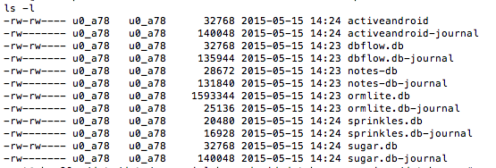

# AndroidDatabaseLibraryComparison
A test between a few of the popular libraries running a speed test on how fast they load and save data.

## Benchmark Description

There are two benchmarks.  The Simple trial uses a flat schema for an address book so each row is composed of name, address, city, state, and phone columns.  The Complex trial is hierarchical and has support for multiple address books where each address book has contacts and addresses.

## Results

One interesting statistic is the disk usage for each database; OrmLite uses 10x the space of the others:

but its performance still lags behind DBFlow and GreenDao.  These are the results for the Simple trial:

And these are the results for the Complex trial:

